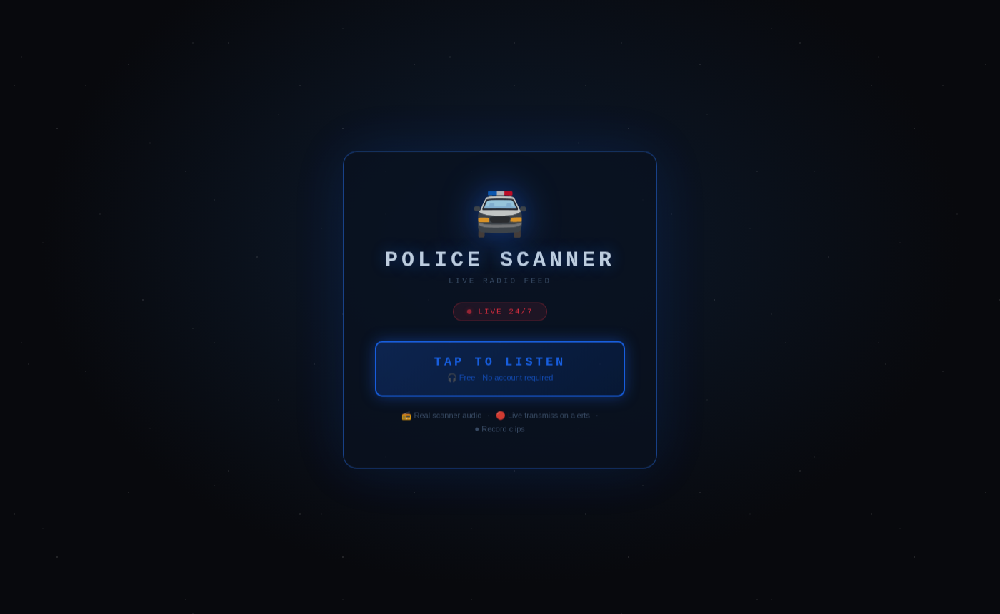
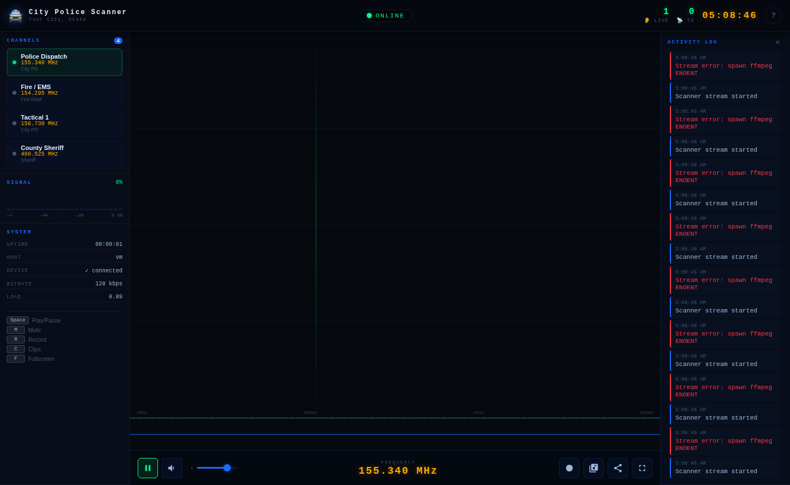

# Online Police Scanner

A real-time web interface for a hardware police scanner, built to run on an **Orange Pi 4 Pro** (or any Linux SBC with ALSA audio input). Plug in a Uniden BCD996XT, visit the page from any browser, and get live audio, a spectrum analyzer, and real-time channel metadata pulled directly from the scanner over USB serial.

---

## Screenshots

### Connect Screen
> The landing page visitors see before audio starts — required by browsers before playing audio.



### Live Scanner Dashboard
> Full dashboard with spectrum analyzer, scanner info bar, channels, signal meter, activity log, and controls.



> The scanner info bar (between the TX banner and visualizer) shows the live System / Group / Channel / Mode pulled from the BCD996XT over USB serial. The TX banner expands to include the channel name during a transmission.

---

## Features

| | Feature | Description |
|---|---|---|
| 🔴 | Live audio stream | Real-time MP3 from your physical scanner over HTTP |
| 📡 | Serial integration | Reads BCD996XT via USB — exact frequency, channel name, group, system, modulation, P25 NAC |
| ⚡ | Hardware squelch VAD | Transmission detection uses the scanner's own squelch signal — perfectly accurate |
| 📊 | Spectrum analyzer | 80-bar FFT canvas with peak dots and mirror reflection |
| 〰️ | Waveform display | Time-domain oscilloscope strip |
| 📡 | Signal meter | 24-bar VU meter, color-coded green → amber → red |
| 📋 | Activity log | Timestamped log of every detected transmission with channel info |
| 👂 | Listener count | Live count of connected clients |
| ⏺ | Browser recording | One-click clip capture, saved to your Downloads folder |
| 📂 | Server clips | Browse and download clips saved on the server |
| 📻 | Channel panel | Configurable channel list; auto-highlights the active channel |
| ⌨️ | Keyboard shortcuts | Space, M, R, C, F, ↑↓, ? |
| 📱 | Responsive | Adapts from desktop down to mobile |
| 🔗 | Share button | Copies URL or triggers native share sheet on mobile |
| 🖥️ | Fullscreen | Immersive kiosk-friendly mode |

---

## Requirements

- **Node.js ≥ 18**
- **ffmpeg** with `libmp3lame` support
- A Uniden BCD996XT scanner (or compatible DMA-protocol Uniden scanner)
- USB mini-B cable (front port of the BCD996XT)
- Linux with ALSA — tested on Orange Pi 4 Pro with Armbian

The serial integration is optional. The audio stream works without it; you just lose the channel metadata and fall back to ffmpeg-based audio-level VAD.

---

## Quick Start

```bash
# 1. Install Node.js and ffmpeg
curl -fsSL https://deb.nodesource.com/setup_18.x | sudo bash -
sudo apt install -y nodejs ffmpeg

# 2. Clone and install
git clone https://github.com/evilgenius79/online-police-scanner.git
cd online-police-scanner
npm install          # installs express, socket.io, serialport

# 3. Find your scanner's audio device
arecord -l
# Example output: "card 1, device 0" → use hw:1,0

# 4. Edit config.json — set audioDevice, scannerPort, name, channels
nano config.json

# 5. Prepare the BCD996XT
#    Menu → PC Control → PC Control: On
#    Menu → PC Control → Front Port: 115200

# 6. Start
npm start
# → Open http://<your-pi-ip>:3000 in any browser
```

---

## Configuration (`config.json`)

```jsonc
{
  "port": 3000,
  "audioDevice": "hw:1,0",       // from: arecord -l

  // Audio stream
  "bitrate": "128k",
  "sampleRate": 44100,

  // Fallback VAD (used only when serial is not connected)
  "signalThreshold": -45,         // dBFS above which = active transmission
  "silenceTimeout": 2000,         // ms of silence before ending a transmission

  // BCD996XT serial (USB mini-B front port → /dev/ttyUSB0)
  "scannerPort": "/dev/ttyUSB0",  // set to null or remove to disable
  "scannerBaud": 115200,          // must match scanner's Front Port baud setting
  "pollInterval": 300,            // GLG poll interval in ms (200–500 recommended)

  "scannerName": "City Police Scanner",
  "location": "Your City, State",

  "channels": [
    {
      "id": 1,
      "name": "Police Dispatch",
      "frequency": "155.340 MHz",
      "department": "City PD",
      "active": true,
      "color": "blue"
    },
    {
      "id": 2,
      "name": "Fire / EMS",
      "frequency": "154.295 MHz",
      "department": "Fire Dept",
      "active": false,
      "color": "red"
    }
  ]
}
```

---

## BCD996XT Setup

1. On the scanner: **Menu → PC Control → PC Control: On**
2. On the scanner: **Menu → PC Control → Front Port: 115200**
3. Connect the USB mini-B cable from the scanner's front port to your Pi
4. Confirm the device node: `ls /dev/ttyUSB*` — should show `/dev/ttyUSB0`
5. Set `"scannerPort": "/dev/ttyUSB0"` in `config.json`

If you use the rear DB9 port instead, set the baud to 115200 in the scanner menu and change `audioDevice` to match your USB-to-serial adapter's device node (e.g. `/dev/ttyUSB1` if the front USB audio is already on `ttyUSB0`).

**Driver note (Linux):** The Prolific PL2303 chip in the Uniden USB-1 cable works out of the box on most Armbian/Debian builds. If the device doesn't appear, install the driver: `sudo apt install linux-modules-extra-$(uname -r)`.

---

## Run as a systemd Service (Auto-start on Boot)

```bash
# Copy files to /opt/police-scanner
sudo mkdir /opt/police-scanner
sudo cp -r . /opt/police-scanner
sudo npm --prefix /opt/police-scanner install --omit=dev

# Create a dedicated user in the audio and dialout groups
sudo useradd -r -s /bin/false -G audio,dialout scanner

# Install and enable the service
sudo cp systemd/scanner-web.service /etc/systemd/system/
sudo systemctl daemon-reload
sudo systemctl enable --now scanner-web

# Check status and logs
sudo systemctl status scanner-web
journalctl -fu scanner-web
```

The `dialout` group is required for serial port access on most Linux distributions.

---

## Architecture

```
[Uniden BCD996XT hardware]
       │ 3.5mm / USB audio          │ USB mini-B serial
       ▼                            ▼
[Orange Pi 4 Pro — ALSA]     [/dev/ttyUSB0]
       │                            │
  ┌────┴────────────────────────────┴───────────────────────┐
  │                       server.js                         │
  │                                                         │
  │  ┌─────────────┐   GET /stream                          │
  │  │ ffmpeg MP3  │──► HTTP chunked MP3 ───────────────────│──► Browsers
  │  │   stream    │                                        │
  │  └─────────────┘                                        │
  │  ┌─────────────────────────────────────────────────┐    │
  │  │ scanner-serial.js                               │    │
  │  │  GLG poll every 300ms                           │    │
  │  │  → frequency, sys/group/channel names           │──► Socket.io
  │  │  → squelch state (authoritative VAD)            │    │──► Browsers
  │  │  → modulation, P25 NAC, talkgroup               │    │
  │  │  → auto-reconnect on cable pull                 │    │
  │  └─────────────────────────────────────────────────┘    │
  │  ┌─────────────┐   fallback when serial not connected   │
  │  │ ffmpeg level│──► dBFS analysis → signal / activity ──│──► Browsers
  │  │   monitor   │                                        │
  │  └─────────────┘                                        │
  └─────────────────────────────────────────────────────────┘
```

---

## API Reference

| Method | Endpoint | Description |
|---|---|---|
| `GET` | `/stream` | Live MP3 audio stream |
| `GET` | `/api/status` | JSON — live status, listeners, signal, serial state |
| `GET` | `/api/log?limit=50` | Recent activity log entries |
| `GET` | `/api/clips` | List server-side recorded clips |
| `GET` | `/api/clips/:name` | Download a clip |
| `DELETE` | `/api/clips/:name` | Delete a clip |

### Socket.io Events (server → client)

| Event | Payload | Description |
|---|---|---|
| `init` | full state object | Sent immediately on connect |
| `status` | `{ live }` | Stream came up or went down |
| `signal` | `{ level, active }` | Audio level (0–100) + transmission active flag |
| `listeners` | `{ count }` | Listener count changed |
| `activity` | log entry | New transmission or info event |
| `scanner` | channel data object | GLG update from serial — freq, names, squelch, etc. |
| `scannerStatus` | `{ connected }` | Serial port connected / disconnected |

#### `scanner` event payload

```jsonc
{
  "frequency":   "462.5000 MHz",   // null on trunked systems
  "talkgroup":   null,             // talkgroup ID string (trunked), or null
  "modulation":  "FM",             // AM / FM / NFM / WFM
  "attenuation": false,
  "ctcss":       null,             // CTCSS tone or DCS code, null if none
  "systemName":  "City P25",
  "groupName":   "Police Dispatch",
  "channelName": "CH-1 PD",
  "squelch":     true,             // true = receiving audio right now
  "muted":       false,
  "sysTag":      null,
  "chanTag":     null,
  "p25nac":      null              // P25 NAC hex string or null
}
```

---

## Keyboard Shortcuts

| Key | Action |
|---|---|
| `Space` | Play / Pause stream |
| `M` | Toggle mute |
| `R` | Start / stop recording |
| `C` | Open clip library |
| `F` | Toggle fullscreen |
| `↑ / ↓` | Volume up / down |
| `?` | Show keyboard shortcuts |
| `Esc` | Close dialog |
